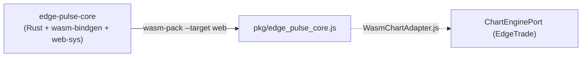

# 🏛️ Arquitectura — `edge-pulse-core` (`Bridge` Rust/Wasm)

> Actualizado: 2026-11-24 | Estado: `⚪ SIN IMPLEMENTAR`

```mermaid
graph LR
    CORE["edge-pulse-core\n(Rust + wasm-bindgen + web-sys)"] -->|wasm-pack --target web| PKG["pkg/edge_pulse_core.js"]
    PKG -.->|WasmChartAdapter.js| PORT["ChartEnginePort (EdgeTrade)"]
```
