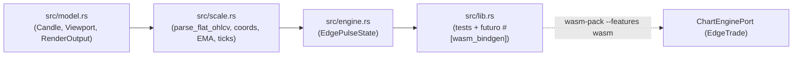

# 🏛️ Arquitectura — `edge-pulse-core` (`Bridge` Rust/Wasm)

> Actualizado: 2026-11-24 | Estado: `🟡 EN PROGRESO` (núcleo puro + 5 tests `cargo test` OK; falta capa `web-sys` Wasm)

```mermaid
graph LR
    MOD["src/model.rs\n(Candle, Viewport, RenderOutput)"] --> SCL["src/scale.rs\n(parse_flat_ohlcv, coords, EMA, ticks)"]
    SCL --> ENG["src/engine.rs\n(EdgePulseState)"]
    ENG --> LIB["src/lib.rs\n(tests + futuro #[wasm_bindgen])"]
    LIB -.->|wasm-pack --features wasm| PORT["ChartEnginePort (EdgeTrade)"]
```
